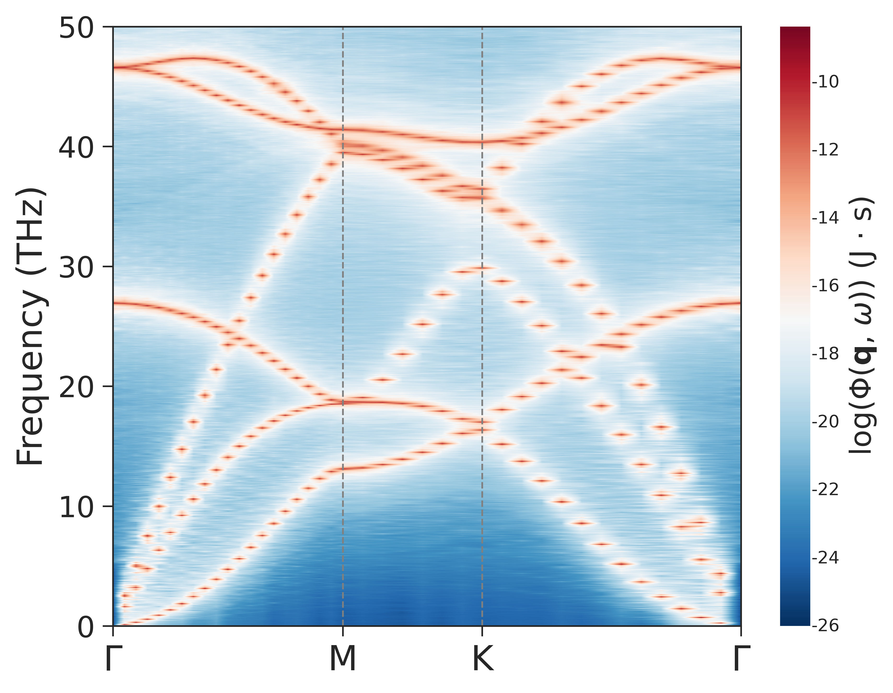
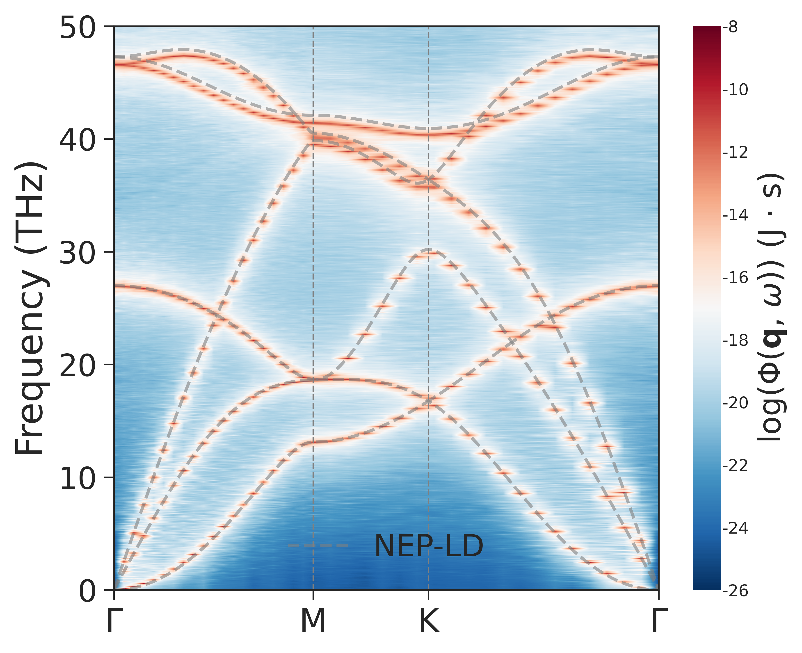

# 📢 pySED Tutorial: In-Plane Graphene SED with GPUMD

This example computes the in-plane phonon SED of graphene with GPUMD and pySED,
then compares the SED map with a lattice-dynamics (LD) reference.

Reproduce this example before applying pySED to a new two-dimensional material.

Use this example together with the
[online manual](https://pysed.readthedocs.io/en/latest/). For any unclear
`input_SED.in` setting, go directly to the
[`input_SED.in` parameter guide](https://pysed.readthedocs.io/en/latest/input_parameters.html).

---

## 🧭 Workflow Map

`[1. Structure] -> [2. GPUMD trajectory] -> [3. pySED SED] -> [4. Plot] -> [5. Compare with LD]`

| Stage | Folder | Main files | Output |
|---|---|---|---|
| `[1. Structure]` | `structure/` | `POSCAR_graphene`, `generate_gpumd_xyz.py` | `model.xyz`, `basis.in` |
| `[2. GPUMD]` | `gpumd_run/` | `run.in`, `nep.txt` | `dump.xyz` |
| `[3. pySED]` | `SED/` | `input_SED.in` | `graphene_all.SED`, `graphene_all.Qpts`, `graphene_all.THz` |
| `[4. Plot]` | `SED/` | `input_SED.in` | `graphene_all-SED.png` |
| `[5. LD]` | `SED/compare_LD/` | LD and plotting scripts | `Graphene.png` |

---

## 🧱 [Step 1] -> Generate `model.xyz` and `basis.in`

Go to the structure folder:

```bash
cd example/In_plane_graphene_gpumd/structure
python generate_gpumd_xyz.py
```

The structure script uses:

```python
from pySED.structure import generate_data

def generate_required_files(input_file, supercell):
    structure = generate_data.structure_maker(structure_file_name=input_file)
    structure.replicate_supercell(supercell=supercell)
    structure.write_xyz(filename='model.xyz', pbc="T T F")
    structure.write_lattice_basis_file()

if __name__ == "__main__":
    file_name = 'POSCAR_graphene'
    supercell = (40, 40, 1)
    generate_required_files(file_name, supercell)
```

Input structure support:

- POSCAR-style files are supported, as used here with `POSCAR_graphene`.
- `.xyz` files are also supported. For example, set
  `file_name = 'graphene_primitive.xyz'` if your starting structure is an XYZ
  file.

The GPUMD structure uses `pbc="T T F"` because this graphene example is
periodic in-plane.

---

## 🚀 [Step 2] -> Run GPUMD and write `dump.xyz`

Go to the GPUMD folder:

```bash
cd ../gpumd_run
gpumd
```

The production block is:

```text
ensemble       nve
dump_exyz      10     1
run            500000
```

The matching pySED settings are:

```text
total_num_steps = 500000
time_step = 1
output_data_stride = 10
dump_xyz_file = '../gpumd_run/dump.xyz'
```

---

## ⚙️ [Step 3] -> Compute SED with pySED

Go to the SED folder:

```bash
cd ../SED
pysed input_SED.in
```

For the first run, use:

```text
plot_SED = 0
```

The graphene path is `G-M-K-G`:

```text
num_qpaths = 3
q_path_name = 'GMKG'
q_path = 0.0 0.0 0.0  0.5 0.0 0.0  0.3333333 0.3333333 0.0  0.0 0.0 0.0
```

---

## 📈 [Step 4] -> Plot SED

After the SED files exist, set the following values in `SED/input_SED.in`:

```text
plot_SED = 1
use_contourf = 1
```

Tune these plotting parameters in `SED/input_SED.in` if the contrast is not
clear:

- [`plot_cutoff_freq`](https://pysed.readthedocs.io/en/latest/input_parameters.html#plot-cutoff-freq)
- [`plot_interval`](https://pysed.readthedocs.io/en/latest/input_parameters.html#plot-interval)
- `plot_color`
- `colorbar_min`
- `colorbar_max`

The raw pySED figure is:



---

## 🔍 [Step 5] -> Compare SED with lattice dynamics

This example includes an LD comparison workflow in `SED/compare_LD/`:

- `get_phonon_dispersion.py` calculates the NEP-driven LD dispersion using
  `calorine` and `phonopy`.
- `plot_phonon_dis_NEP_SED.py` overlays the LD branches on the pySED SED map.

The final comparison figure should show strong agreement between the SED
background and LD branches.



---

## ✅ Checklist

- [x] [`num_atoms = 3200`](https://pysed.readthedocs.io/en/latest/input_parameters.html#num-atoms) matches `basis.in` and `dump.xyz`.
- [x] [`supercell_dim = 40 40 1`](https://pysed.readthedocs.io/en/latest/input_parameters.html#supercell-dim) matches the generated graphene supercell.
- [x] [`output_data_stride = 10`](https://pysed.readthedocs.io/en/latest/input_parameters.html#output-data-stride) matches `dump_exyz 10 1`.
- [x] `q_path_name = 'GMKG'` has `num_qpaths + 1` labels.
