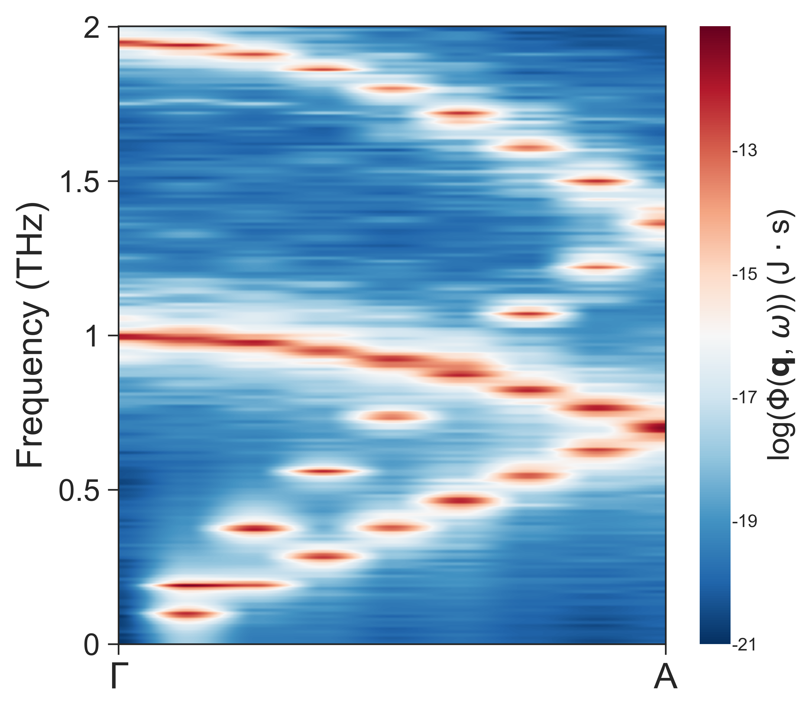

# pySED Examples

This directory contains example workflows for calculating phonon spectral
energy density (SED) with **pySED**. Please reproduce at least one example
before applying pySED to a new material.

---

## Workflow Map

`[1. Structure] -> [2. GPUMD or LAMMPS MD] -> [3. pySED compute] -> [4. Plot/Fit] -> [5. LD check]`

Each modern GPUMD example follows this sequence:

- [x] **[1. Structure]** Generate `model.xyz` for GPUMD and `basis.in` for pySED.
- [x] **[2. MD]** Run GPUMD to produce `dump.xyz` with positions and velocities.
- [x] **[3. Compute]** Run pySED with `plot_SED = 0`.
- [x] **[4. Plot/Fit]** Run pySED with `plot_SED = 1`, then tune plotting or Lorentz fitting parameters.
- [x] **[5. Validate]** Compare with lattice dynamics when an LD workflow is provided.

`structure_maker` can read both POSCAR-style files and `.xyz` files as input
structures. To use an `.xyz` file, set `structure_file_name='your_structure.xyz'`
in the structure-generation script, then write `model.xyz` and `basis.in`.

---

## Recommended Examples

| Dimension | Folder | Purpose | Preview |
|---|---|---|---|
| 1D | [`CNT`](CNT) | Carbon nanotube SED along the tube axis. |  |
| 2D | [`In_plane_graphene_gpumd`](In_plane_graphene_gpumd) | In-plane graphene SED with LD comparison. |  |
| 2D/Layered | [`MoS2_gpumd`](MoS2_gpumd) | Low-frequency out-of-plane SED of layered MoS2. |  |
| 3D | [`Silicon_primitive_gpumd`](Silicon_primitive_gpumd) | Bulk silicon SED with LD comparison. |  |

---

## Reference and Legacy Folders

- **`Ref_Phonon_dispersion_from_phonopy`**
  Reference lattice-dynamics workflows using phonopy. Use these to check
  whether SED branches agree with harmonic phonon dispersions.

- **`For_old_version_example`**
  Older LAMMPS-based and legacy workflows. Start from the modern GPUMD examples
  above unless you specifically need one of these older cases.

- **`tutorials`**
  Jupyter-based tutorial material, including a MoS2 notebook workflow.

---

## Quick Checks

- `num_atoms` must match the trajectory and the maximum atom id in `basis.in`.
- `output_data_stride` must match the MD trajectory dump stride.
- `supercell_dim` must match the supercell used to generate `model.xyz` and
  `basis.in`.
- Use `plot_slice = 1` to inspect a single q-point before fitting all q-points.
- Use `output_partial = 1` for atom-type and direction-resolved partial SED.

**Author:** pySED development team
**Recommended version:** pySED v2.2.0 and above
