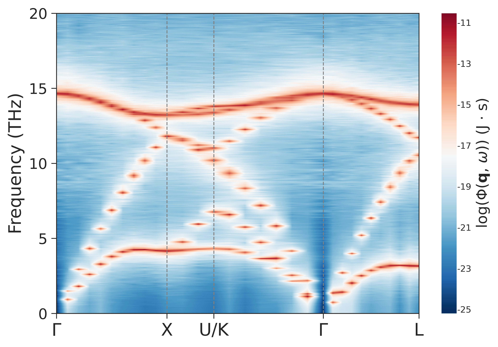
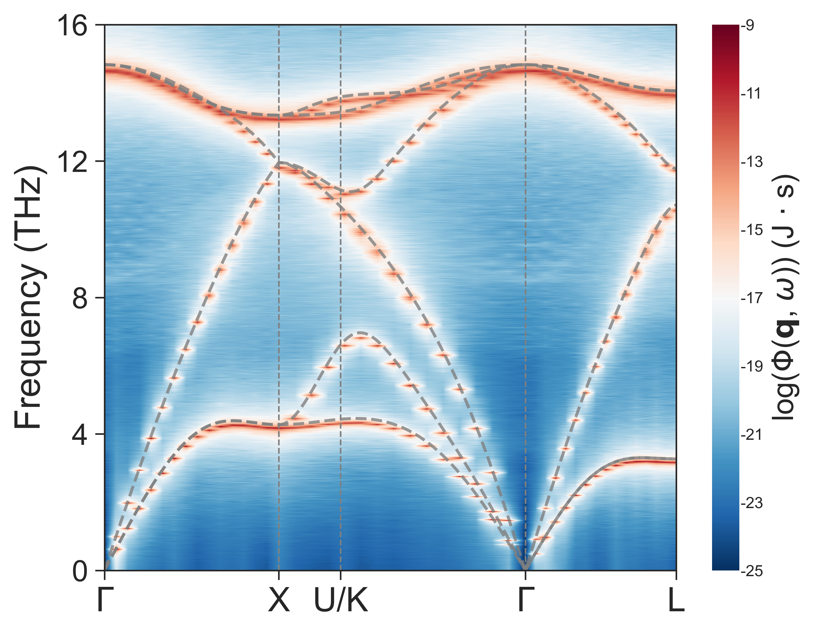

# 📢 pySED Tutorial: Bulk Silicon SED with GPUMD

This example computes the phonon SED of bulk silicon with GPUMD and pySED,
then compares the result with a lattice-dynamics (LD) reference.

Reproduce this example before applying pySED to a new three-dimensional
crystalline material.

Use this example together with the
[online manual](https://pysed.readthedocs.io/en/latest/). For any unclear
`input_SED.in` setting, go directly to the
[`input_SED.in` parameter guide](https://pysed.readthedocs.io/en/latest/input_parameters.html).

---

## 🧭 Workflow Map

`[1. Structure] -> [2. GPUMD trajectory] -> [3. pySED SED] -> [4. Compare with LD] -> [5. Fit q-point]`

| Stage | Folder | Main files | Output |
|---|---|---|---|
| `[1. Structure]` | `structure/` | `POSCAR_prim`, `generate_lammps_data.py` | `model.xyz`, `basis.in` |
| `[2. GPUMD]` | `gpumd_run/` | `run.in`, `nep.txt` | `dump.xyz` |
| `[3. pySED]` | `SED/` | `input_SED.in` | `silicon.SED`, `silicon.Qpts`, `silicon.THz` |
| `[4. LD]` | `SED/compare_LD/` | LD and plotting scripts | `Silicon.png` |
| `[5. Fit]` | `SED/` | Lorentzian options | q-point fitting figure |

---

## 🧱 [Step 1] -> Generate `model.xyz` and `basis.in`

Go to the structure folder:

```bash
cd example/Silicon_primitive_gpumd/structure
python generate_lammps_data.py
```

The script uses:

```python
from pySED.structure import generate_data

def generate_required_files(input_file, supercell):
    structure = generate_data.structure_maker(structure_file_name=input_file)
    structure.replicate_supercell(supercell=supercell)
    structure.write_xyz(filename='model.xyz', pbc="T T T")
    structure.write_lattice_basis_file()

if __name__ == "__main__":
    file_name = 'POSCAR_prim'
    supercell = (20, 20, 20)
    generate_required_files(file_name, supercell)
```

Input structure support:

- POSCAR-style files are supported, as used here with `POSCAR_prim`.
- `.xyz` files are also supported. For example, set
  `file_name = 'Si_primitive.xyz'` if your starting structure is an XYZ file.

Generated files:

- `model.xyz`: GPUMD structure file.
- `basis.in`: pySED basis mapping file.

---

## 🚀 [Step 2] -> Run GPUMD and write `dump.xyz`

Go to the GPUMD folder:

```bash
cd ../gpumd_run
gpumd
```

The production block is:

```text
ensemble       nve
dump_exyz      10     1
run            500000
```

The matching pySED settings are:

```text
total_num_steps = 500000
time_step = 1
output_data_stride = 10
dump_xyz_file = '../gpumd_run/dump.xyz'
```

---

## ⚙️ [Step 3] -> Compute and plot SED

Go to the SED folder:

```bash
cd ../SED
pysed input_SED.in
```

For the first run, use:

```text
plot_SED = 0
```

After `silicon.SED`, `silicon.Qpts`, and `silicon.THz` exist, set the
following value in `SED/input_SED.in`:

```text
plot_SED = 1
```

The silicon q-path is:

```text
num_qpaths = 5
q_path_name = 'GXUKGL'
q_path = 0.0 0.0 0.0  0.5 0.0 0.5  0.625 0.25 0.625  0.375 0.375 0.75  0.0 0.0 0.0  0.5 0.5 0.5
```

The raw pySED SED map is:



---

## 🔍 [Step 4] -> Compare SED with lattice dynamics

The `SED/compare_LD/` directory contains:

- `get_phonon_dispersion.py` calculates the NEP-driven LD dispersion using
  `calorine` and `phonopy`.
- `plot_phonon_dis_NEP_SED.py` overlays the LD branches on the pySED SED map.

The final comparison figure should show strong agreement between the SED
background and LD branches.



---

## 🎯 [Step 5] -> Fit a q-point

The example includes a single-q-point fitting result for q-point index 2. To
repeat or adjust the fit, set these values in `SED/input_SED.in`:

```text
plot_SED = 1
plot_slice = 1
qpoint_slice_index = 2
lorentz = 1
lorentz_fit_cutoff = 20
```

Tune these key parameters in `SED/input_SED.in`:

- [`qpoint_slice_index`](https://pysed.readthedocs.io/en/latest/input_parameters.html#qpoint-slice-index)
- [`peak_height`](https://pysed.readthedocs.io/en/latest/input_parameters.html#peak-height)
- [`peak_prominence`](https://pysed.readthedocs.io/en/latest/input_parameters.html#peak-prominence)
- [`initial_guess_hwhm`](https://pysed.readthedocs.io/en/latest/input_parameters.html#initial-guess-hwhm)

---

## ✅ Checklist

- [x] [`num_atoms = 16000`](https://pysed.readthedocs.io/en/latest/input_parameters.html#num-atoms) matches `basis.in` and `dump.xyz`.
- [x] [`supercell_dim = 20 20 20`](https://pysed.readthedocs.io/en/latest/input_parameters.html#supercell-dim) matches the generated silicon supercell.
- [x] [`output_data_stride = 10`](https://pysed.readthedocs.io/en/latest/input_parameters.html#output-data-stride) matches `dump_exyz 10 1`.
- [x] `prim_unitcell` is consistent with the primitive silicon cell.
- [x] `q_path_name = 'GXUKGL'` has `num_qpaths + 1` labels.
